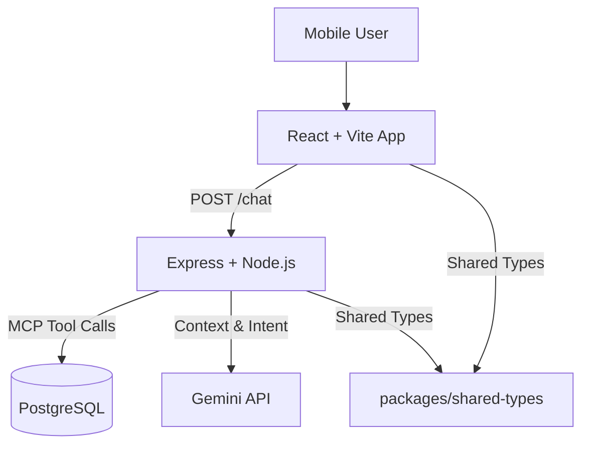

# AI Shopping Chat Agent 📱

A production-grade AI-powered shopping assistant for mobile phones, built with a modern monorepo architecture. 
This agent helps users find, compare, and understand smartphones using a local PostgreSQL database and Gemini AI via the Model Context Protocol (MCP).

## 🏗 Architecture

The project follows a Monorepo structure managed by `npm workspaces`, ensuring strict separation of concerns and type safety.



### Tech Stack
- **Frontend**: React, Vite, TypeScript, Tailwind CSS, Lucide Icons.
- **Backend**: Node.js, Express, TypeScript.
- **AI/LLM**: Google Gemini Pro via custom MCP (Model Context Protocol).
- **Database**: PostgreSQL (Raw SQL queries with `pg` driver).
- **Monorepo**: npm workspaces.

## 🚀 Features

- **Intelligent Search**: "Find phones under 30k with good cameras" -> Translation to SQL queries.
- **Side-by-Side Comparison**: Automatic table generation for comparing specs.
- **Concept Explanation**: Explains technical terms like "OIS" or "AMOLED" simply without marketing fluff.
- **Safety First**: Refuses toxic queries, prompt injection, and speculative data generation.
- **Premium UI**: Glassmorphism design, responsive mobile-first layout.

## 🛠 Setup & Running Locally

### Prerequisites
- Node.js (v18+)
- PostgreSQL
- Gemini API Key

### 1. Database Setup
Create a PostgreSQL database and run the schema/seeds:
```bash
# Create DB
createdb mobile_chat

# Run Schema
psql -d mobile_chat -f db/schema.sql

# Seed Data
psql -d mobile_chat -f db/seed.sql
```

### 2. Environment Variables
Create `.env` in `apps/backend`:
```env
PORT=3001
GEMINI_API_KEY=your_key_here
DB_USER=postgres
DB_HOST=localhost
DB_NAME=mobile_chat
DB_PASSWORD=postgres
DB_PORT=5432
```

### 3. Install & Build
```bash
# Install dependencies
npm install

# Build shared types
npm run build --workspace=@repo/shared-types
```

### 4. Run Services
In separate terminals:

**Backend:**
```bash
npm run dev:backend
```

**Frontend:**
```bash
npm run dev:frontend
```
Open http://localhost:5173 to chat!

## 🛡 Safety Strategy

The agent is designed with strict boundaries:
1.  **Tool-First Reasoning**: The LLM is instructed to *always* use tools to fetch data, preventing hallucination of specs.
2.  **Intent Parsing**: We use a two-step prompting strategy—first to classify intent/extract parameters, then to generate the user-facing response.
3.  **Refusal Logic**: The system prompt explicitly forbids answering irrelevant queries, toxic content, or revealing internal instructions.

## ⚠️ Known Limitations
-   **Conversation Memory**: Currently stateless per request (MVP design).
-   **Search Complexity**: Basic keyword and range matching; fuzzy search could be improved with pgvector.
-   **Mocked MCP**: The MCP implementation is a direct internal integration rather than a standalone stdio/http MCP server, for simplicity in this Node.js architecture.

---
